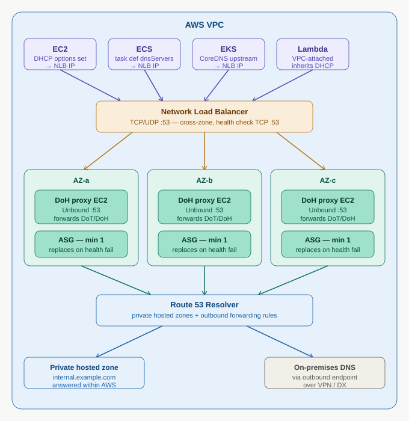

# DoH Proxy — HA Architecture

DNS over HTTPS (DoH) proxy deployed in high-availability configuration across multiple Availability Zones, serving all VPC compute services with encrypted DNS resolution.



---

## Architecture overview

The DoH proxy fleet sits between all VPC compute workloads and the Route 53 Resolver. It accepts plain DNS (UDP/TCP port 53) from clients — because EC2, ECS, EKS, and Lambda all speak plain DNS natively — and re-sends those queries upstream over encrypted DNS-over-TLS (DoT, port 853) or DNS-over-HTTPS (DoH, port 443). The encryption happens on the outbound leg from the proxy.

```
Compute (EC2 / ECS / EKS / Lambda)
  │  plain DNS :53  [AWS fabric — encrypted at hypervisor layer]
  ▼
Network Load Balancer  (TCP+UDP :53, cross-zone)
  │  distributes across AZs
  ▼
DoH Proxy EC2 fleet  (Unbound, one ASG per AZ)
  │  DoT/DoH — application-layer encryption
  ▼
Route 53 Resolver  (169.254.169.253)
  ├── Private hosted zones  →  answered within AWS
  └── corp.internal         →  outbound endpoint → VPN/DX → on-premises DNS
```

---

## Components

### Network Load Balancer

| Property | Value |
|---|---|
| Type | Internal NLB |
| Listeners | TCP :53 and UDP :53 |
| Cross-zone load balancing | Enabled |
| Health check | TCP :53, interval 10 s, threshold 2 |

The NLB provides a stable set of private IPs that the DHCP options set points to. Cross-zone balancing ensures queries are spread evenly even if one AZ has fewer instances.

### DoH proxy EC2 (Unbound)

One Auto Scaling Group per Availability Zone, minimum one instance per AZ (so minimum three instances total across three AZs).

**Instance sizing:** `t3.small` handles approximately 50,000 queries per second. Scale up to `t3.medium` or `c6i.large` for higher throughput workloads.

**Unbound configuration:**

```
server:
  interface: 0.0.0.0
  port: 53
  access-control: 10.0.0.0/8 allow
  tls-cert-bundle: /etc/ssl/certs/ca-certificates.crt
  cache-min-ttl: 30
  prefetch: yes
  num-threads: 2

forward-zone:
  name: "."
  forward-tls-upstream: yes
  forward-addr: 169.254.169.253@853
```

**Auto Scaling Group settings:**

| Property | Value |
|---|---|
| Min capacity | 1 per AZ (3 total) |
| Max capacity | 2 per AZ (6 total) |
| Health check type | ELB |
| Health check grace period | 60 s |
| Scale-out trigger | CPU > 70% or NetworkPacketsIn > 40,000/s |

### Route 53 Resolver

Handles two query types downstream of the proxy:

- **Private hosted zones** — resolved entirely within AWS, no outbound traffic
- **Forwarded zones** (e.g. `corp.internal`) — forwarded via outbound resolver endpoint over VPN or Direct Connect to on-premises DNS

---

## How each compute service picks up the resolver

### VPC DHCP options set

Set the DHCP `domain-name-servers` to the NLB's private IP(s). All services that inherit VPC DHCP pick this up automatically.

```bash
aws ec2 create-dhcp-options \
  --dhcp-configurations \
    "Key=domain-name-servers,Values=[<NLB-private-IP>]" \
    "Key=domain-name,Values=[internal.example.com]"

aws ec2 associate-dhcp-options \
  --dhcp-options-id dopt-xxxxxxxx \
  --vpc-id vpc-xxxxxxxx
```

### EC2

Inherits DHCP automatically. No per-instance configuration needed. Existing instances pick up changes at next DHCP lease renewal.

```bash
# Force immediate pickup on an existing instance
sudo dhclient -r && sudo dhclient
```

### ECS — EC2 launch type

Inherits the host's `/etc/resolv.conf`. No task-level configuration needed.

### ECS — Fargate

Does **not** inherit VPC DHCP automatically. Must be set explicitly per task definition:

```json
{
  "family": "my-task",
  "networkMode": "awsvpc",
  "dnsServers": ["<NLB-private-IP>"],
  "dnsSearchDomains": ["internal.example.com"],
  "containerDefinitions": [...]
}
```

### EKS

Pods resolve DNS via CoreDNS, not the VPC resolver directly. Update the CoreDNS ConfigMap to forward upstream to the DoH proxy NLB:

```bash
kubectl edit configmap coredns -n kube-system
```

```
.:53 {
    errors
    health
    kubernetes cluster.local in-addr.arpa ip6.arpa {
      pods insecure
      fallthrough in-addr.arpa ip6.arpa
    }
    prometheus :9153
    forward . <NLB-private-IP>:53 {
      prefer_udp
      health_check 5s
    }
    cache 30
    loop
    reload
    loadbalance
}
```

### Lambda

VPC-attached Lambda functions inherit VPC DHCP automatically — no additional configuration needed. Lambda functions **not** attached to a VPC cannot use this proxy; VPC attachment is required.

---

## DNS resolution path per service

| Service | Inherits DHCP automatically | Extra configuration |
|---|---|---|
| EC2 | Yes | None |
| ECS — EC2 launch type | Yes (inherits host) | None |
| ECS — Fargate | No | Set `dnsServers` in task definition |
| EKS nodes | Yes | None for nodes |
| EKS pods | No (go via CoreDNS) | Update CoreDNS ConfigMap `forward` |
| Lambda (VPC-attached) | Yes | None — must be VPC-attached |
| Lambda (non-VPC) | No | Attach Lambda to VPC |
| RDS, ElastiCache, etc. | Managed by AWS | Not applicable |

---

## Infrastructure as code (Terraform)

```hcl
# NLB — internal, cross-zone
resource "aws_lb" "doh_proxy" {
  name                             = "doh-proxy-nlb"
  internal                         = true
  load_balancer_type               = "network"
  subnets                          = var.private_subnet_ids
  enable_cross_zone_load_balancing = true
}

# TCP listener
resource "aws_lb_listener" "dns_tcp" {
  load_balancer_arn = aws_lb.doh_proxy.arn
  port              = 53
  protocol          = "TCP"
  default_action {
    type             = "forward"
    target_group_arn = aws_lb_target_group.doh_tcp.arn
  }
}

# UDP listener
resource "aws_lb_listener" "dns_udp" {
  load_balancer_arn = aws_lb.doh_proxy.arn
  port              = 53
  protocol          = "UDP"
  default_action {
    type             = "forward"
    target_group_arn = aws_lb_target_group.doh_udp.arn
  }
}

resource "aws_lb_target_group" "doh_tcp" {
  name     = "doh-proxy-tcp"
  port     = 53
  protocol = "TCP"
  vpc_id   = var.vpc_id
  health_check {
    protocol            = "TCP"
    port                = 53
    healthy_threshold   = 2
    unhealthy_threshold = 2
    interval            = 10
  }
}

resource "aws_lb_target_group" "doh_udp" {
  name     = "doh-proxy-udp"
  port     = 53
  protocol = "UDP"
  vpc_id   = var.vpc_id
  health_check {
    protocol            = "TCP"
    port                = 53
    healthy_threshold   = 2
    unhealthy_threshold = 2
    interval            = 10
  }
}

# Auto Scaling Group — min 1 per AZ
resource "aws_autoscaling_group" "doh_proxy" {
  name                      = "doh-proxy-asg"
  min_size                  = 3
  max_size                  = 6
  desired_capacity          = 3
  vpc_zone_identifier       = var.private_subnet_ids
  target_group_arns         = [
    aws_lb_target_group.doh_tcp.arn,
    aws_lb_target_group.doh_udp.arn,
  ]
  health_check_type         = "ELB"
  health_check_grace_period = 60

  launch_template {
    id      = aws_launch_template.doh_proxy.id
    version = "$Latest"
  }

  tag {
    key                 = "Name"
    value               = "doh-proxy"
    propagate_at_launch = true
  }
}

resource "aws_launch_template" "doh_proxy" {
  name_prefix            = "doh-proxy-"
  image_id               = data.aws_ami.ubuntu.id
  instance_type          = "t3.small"
  vpc_security_group_ids = [aws_security_group.doh_proxy.id]

  iam_instance_profile {
    arn = aws_iam_instance_profile.doh_proxy.arn
  }

  user_data = base64encode(<<-EOF
    #!/bin/bash
    apt-get update -y
    apt-get install -y unbound
    cat > /etc/unbound/unbound.conf << 'UNBOUNDCONF'
    server:
      interface: 0.0.0.0
      port: 53
      access-control: 10.0.0.0/8 allow
      tls-cert-bundle: /etc/ssl/certs/ca-certificates.crt
      cache-min-ttl: 30
      prefetch: yes
      num-threads: 2
    forward-zone:
      name: "."
      forward-tls-upstream: yes
      forward-addr: 169.254.169.253@853
    UNBOUNDCONF
    systemctl enable unbound
    systemctl restart unbound
  EOF
  )
}

# DHCP options set
resource "aws_vpc_dhcp_options" "doh" {
  domain_name_servers = [aws_lb.doh_proxy.dns_name]
}

resource "aws_vpc_dhcp_options_association" "doh" {
  vpc_id          = var.vpc_id
  dhcp_options_id = aws_vpc_dhcp_options.doh.id
}
```

---

## Security group rules

```hcl
resource "aws_security_group" "doh_proxy" {
  name   = "doh-proxy-sg"
  vpc_id = var.vpc_id

  # Accept DNS from within VPC
  ingress {
    from_port   = 53
    to_port     = 53
    protocol    = "tcp"
    cidr_blocks = [var.vpc_cidr]
  }
  ingress {
    from_port   = 53
    to_port     = 53
    protocol    = "udp"
    cidr_blocks = [var.vpc_cidr]
  }

  # DoT outbound to Route 53 Resolver
  egress {
    from_port   = 853
    to_port     = 853
    protocol    = "tcp"
    cidr_blocks = ["169.254.169.253/32"]
  }

  # SSM Session Manager (no SSH needed)
  egress {
    from_port   = 443
    to_port     = 443
    protocol    = "tcp"
    cidr_blocks = ["0.0.0.0/0"]
  }
}
```

---

## Observability

### CloudWatch metrics to monitor

| Metric | Namespace | Alert threshold |
|---|---|---|
| `HealthyHostCount` | `AWS/NetworkELB` | < 2 (page immediately) |
| `UnHealthyHostCount` | `AWS/NetworkELB` | > 0 (warn) |
| `ProcessedBytes` | `AWS/NetworkELB` | Baseline deviation > 3σ |
| `CPUUtilization` | `AWS/EC2` (per ASG) | > 70% sustained |
| Unbound cache hit rate | Custom / CloudWatch Agent | < 60% (investigate) |

### Unbound query logging via CloudWatch Agent

```json
{
  "logs": {
    "logs_collected": {
      "files": {
        "collect_list": [
          {
            "file_path": "/var/log/unbound/unbound.log",
            "log_group_name": "/dns/doh-proxy/queries",
            "log_stream_name": "{instance_id}",
            "timestamp_format": "%b %d %H:%M:%S"
          }
        ]
      }
    }
  }
}
```

---

## Suggested repository structure

```
dns/
├── doh-proxy-ha-architecture.md      # this file
├── doh_ha_architecture.png           # architecture diagram
├── doh_ha_architecture.svg           # source SVG (editable)
└── terraform/
    ├── main.tf
    ├── variables.tf
    ├── outputs.tf
    └── README.md
```
