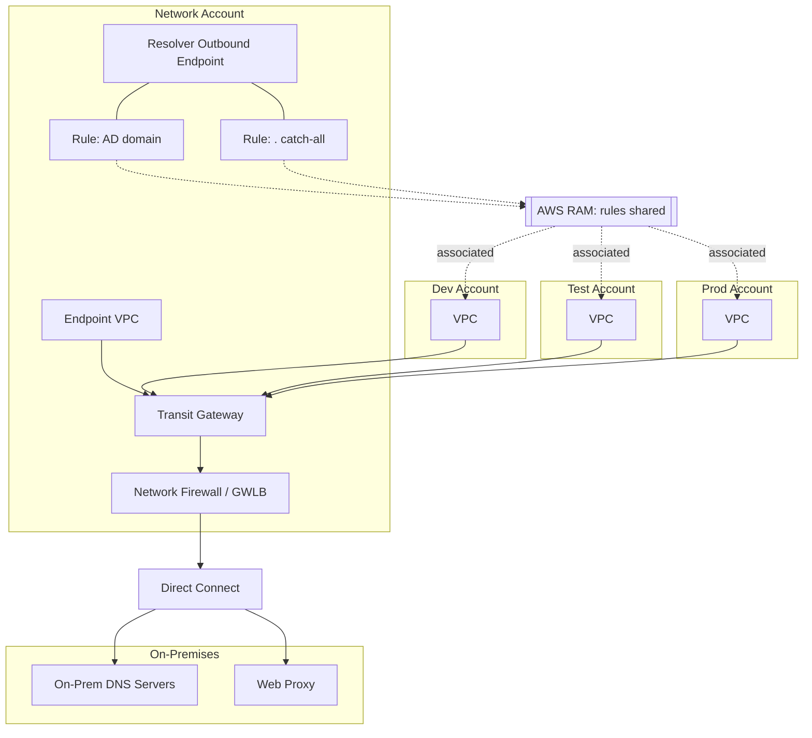
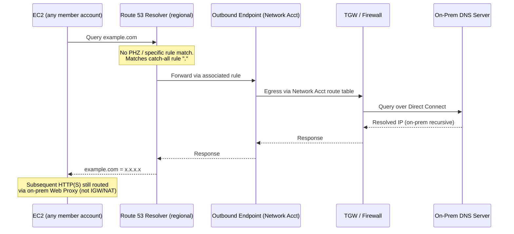

# Part 1 — Hybrid DNS Resolution for Non-Local (Internet) Domains

## 1. Context Recap

- Hub-and-spoke network: Network account owns the Transit Gateway (TGW), shared to all member accounts, with **explicit routes per attachment and no route propagation**.
- No IGW / NAT Gateway anywhere — no direct internet egress from AWS. All internet-bound traffic goes through an **on-premise web proxy**.
- Network account already hosts a Route 53 Resolver setup for Active Directory: an outbound endpoint in the central Endpoint VPC, and a **forwarding rule** targeting the on-prem AD DNS servers, shared to all member accounts via AWS RAM.

Problem to solve: when a workload queries a domain that is neither the AD domain nor a private internal domain (e.g. `example.com`, `github.com`, or any internet name), that query must be resolved by the **on-prem DNS servers**, because the VPC default resolver has no way to reach public DNS (no IGW/NAT).

Note: DNS resolution is separate from application traffic. Even once the name resolves, actual HTTPS connections to internet endpoints still traverse the on-prem web proxy — this design only addresses **name resolution**.

---

## 2. Key Mechanic (why this works without extra TGW routes in spoke VPCs)

A Route 53 Resolver **rule** is a regional, account-owned object. When it is shared via **AWS RAM** and associated with a VPC in a *different* account:

- The DNS query is intercepted by the Route 53 Resolver service at the VPC level (no change needed to the spoke VPC route table).
- The query is forwarded out through the **outbound Resolver endpoint that owns the rule** — and that endpoint's ENIs live in the account that created the rule (the **Network account**), not in the spoke account.
- From there, the packet leaves via the **Network account's** VPC route table → TGW attachment → Direct Connect → on-prem, exactly like the existing AD forwarding path.

Consequences:
- Spoke VPCs need **no additional route table entries** for DNS.
- The Network account's Endpoint VPC route table must have (and already does, for AD) an explicit route to the on-prem DNS CIDR via the TGW attachment.

---

## 3. Design

**Yes**, create a Route 53 Resolver outbound endpoint + a forwarding rule — reusing the same outbound endpoint already used for AD if capacity allows.

### Where each component lives

| Component | Location |
|---|---|
| Resolver **outbound endpoint** | Network account, in the central Endpoint VPC (reuse existing AD endpoint) |
| Forwarding **rule** for domain `.` (catch-all) | Network account, targets on-prem DNS resolver IP(s), via the outbound endpoint |
| Rule **sharing** | AWS RAM resource share, Network account → all member accounts (OU-level sharing via AWS Organizations recommended) |
| Rule **association** | Each member account associates the shared rule to its local VPC(s) |
| Security Group on outbound endpoint ENIs | Allow UDP/TCP 53 egress to on-prem DNS server CIDR |
| Network account VPC route table | Explicit route to on-prem DNS CIDR via TGW attachment (already exists for AD; verify it covers the general DNS server range, not only DC IPs) |

### Rule design

- Keep the existing **domain-specific rule** for the AD domain (more specific rules win).
- Add a **catch-all rule for `.`** (root) targeting the same on-prem DNS resolvers. This ensures any query that doesn't match the AD rule, a more specific rule, or a local Private Hosted Zone gets forwarded on-prem instead of falling through to the Amazon-provided VPC resolver (which would attempt public DNS and fail).
- Route 53 Resolver rule precedence is **most-specific-domain wins**, so the `.` rule sits safely underneath any AD/internal rules without conflict.

---

## 4. Diagrams

### 4.1 Architecture

### 4.2 Query flow — internet domain

---

## 5. Implementation Checklist

1. **Network account**
   - [ ] Confirm outbound Resolver endpoint capacity in the Endpoint VPC; reuse if possible, else add a second.
   - [ ] Create forwarding rule for `.` → on-prem DNS resolver IP(s).
   - [ ] Confirm Endpoint VPC route table has explicit TGW route to on-prem DNS CIDR.
   - [ ] Update Security Groups on outbound endpoint ENIs (UDP/TCP 53 to on-prem DNS CIDR).
2. **RAM / Organizations**
   - [ ] Share the `.` rule via AWS RAM to the relevant OUs (dev/test/prod).
3. **Each member account**
   - [ ] Auto-accept (if Org-based sharing) or explicitly accept the RAM share.
   - [ ] Associate the shared rule with each local VPC.
4. **Validation**
   - [ ] From a workload in each account tier, resolve: AD name, arbitrary internet name. Confirm both succeed and both traverse on-prem DNS.
   - [ ] Enable Resolver query logging centrally for visibility.

---

## 6. Notes

- Because the catch-all `.` rule uses lowest specificity, it never conflicts with the AD rule or any future internal-domain rules (see Part 2).
- No IGW/NAT is introduced or required — DNS resolution succeeds purely via on-prem recursive resolvers reached over Direct Connect.
- Automate rule association at scale with **CloudFormation StackSets** or **Service Catalog** so new accounts inherit the rule automatically at provisioning time.
