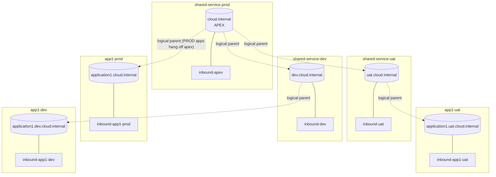
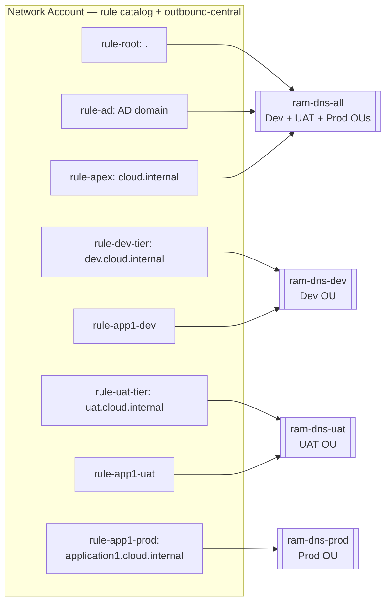
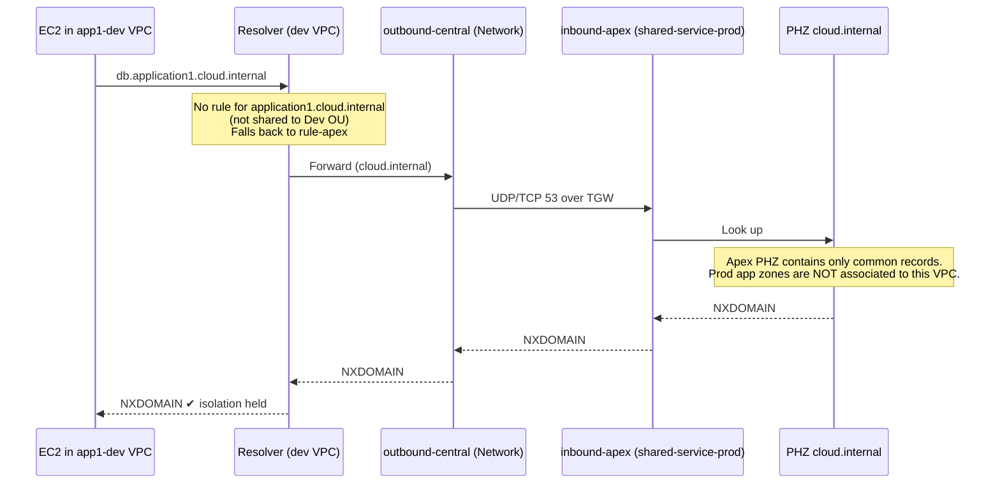

# Part 3 — PHZ Placement, Forwarding Rules, and VPC Associations
### Namespace with `dev` / `uat` tiers and **prod at the apex**

---

## 1. The Namespace Being Built

```
cloud.internal                              ← APEX, owned by shared-service-prod
│
├── application1.cloud.internal             ← PROD app zone (app1-prod account)
├── application2.cloud.internal             ← PROD app zone (app2-prod account)
├── docs.cloud.internal / wiki...           ← records held directly in the apex zone
│
├── uat.cloud.internal                      ← owned by shared-service-uat
│   ├── application1.uat.cloud.internal     ← app1-uat account
│   └── application2.uat.cloud.internal     ← app2-uat account
│
└── dev.cloud.internal                      ← owned by shared-service-dev
    ├── application1.dev.cloud.internal     ← app1-dev account
    └── application2.dev.cloud.internal     ← app2-dev account
```

**There is no `prod.cloud.internal` zone.** Production is the apex. This is the single fact that
drives every design decision below, because it means:

> The zone that must be resolvable by **all three lifecycles** (`cloud.internal`) is also the
> **parent of every production application zone**.

If that is handled naively, a dev workload asking for `application1.cloud.internal` will follow the
apex forwarding rule straight into the production resolver and get an answer. The mitigations for
that are in §2 and are **mandatory**, not optional hardening.

---

## 2. The Two Rules That Preserve Lifecycle Isolation

### 2.1 How Route 53 Resolver actually chooses

For a query from a VPC, Resolver picks the **most specific suffix match** across *both* associated
Private Hosted Zones and associated Resolver rules. On an exact tie between a PHZ and a rule for the
same domain, **the PHZ wins**. Anything unmatched falls to the `.` catch-all rule → on-prem DNS.

That gives three useful consequences:

| Consequence | Why it matters here |
|---|---|
| An app's **own** zone always resolves locally | Local PHZ association exactly matches → beats the identically-named forwarding rule → no dependency on shared services being up. |
| A **more specific rule** beats a **less specific PHZ** | In `shared-service-prod` (which has the apex PHZ attached), a rule for `application1.cloud.internal` still wins and forwards to the app account. |
| A **missing rule** silently degrades to the next-least-specific match | This is exactly the leak vector for prod-under-apex — see below. |

### 2.2 Guardrail A — scope the prod app rules to the Prod OU only

Rules for `application1.cloud.internal`, `application2.cloud.internal`, … are RAM-shared to the
**Prod OU only**. A dev VPC therefore has no rule for that name, so the query falls back to the
`cloud.internal` apex rule.

### 2.3 Guardrail B — never associate a prod app PHZ to the apex resolver VPC

The apex forwarding rule points at the inbound endpoint in `shared-service-prod`. That endpoint can
only answer for PHZs **associated to the VPC it sits in**. So:

> **The `shared-service-prod` resolver VPC must have _only_ `cloud.internal` associated to it.
> Never associate `application1.cloud.internal` (or any other prod app zone) to that VPC.**

With both guardrails in place, a dev query for `db.application1.cloud.internal` goes:
apex rule → apex inbound endpoint → apex PHZ has no such record and no delegation → **NXDOMAIN**. Correct.

Break Guardrail B and every dev/uat account can enumerate production DNS.

### 2.4 Note on where forwarded traffic comes *from*

A rule created in the Network account carries the Network account's **outbound endpoint**. When that
rule is RAM-shared and associated to a dev VPC, the forwarded query egresses from the **Network
account's outbound ENIs**, not from the dev VPC. So:

* Dev/UAT VPCs need **no TGW path** to production — the "no network path across lifecycles" rule holds.
* The **Network account** does need TGW routes to every VPC hosting an inbound endpoint (§6).
* DNS resolution ≠ reachability. Even if a name leaked, the IP would be unroutable from dev. The
  guardrails exist so it doesn't leak in the first place.

---

## 3. Private Hosted Zones — What to Create, Where

| # | Private Hosted Zone | Owning account | Associated VPC(s) | Contents |
|---|---|---|---|---|
| 1 | `cloud.internal` | **shared-service-prod** | `ssprod-vpc` (local only) | Cross-lifecycle common records **and** prod-tier shared records. **No prod app zones.** |
| 2 | `uat.cloud.internal` | **shared-service-uat** | `ssuat-vpc` (local only) | UAT-tier shared records (e.g. `artifact.uat.cloud.internal`) |
| 3 | `dev.cloud.internal` | **shared-service-dev** | `ssdev-vpc` (local only) | Dev-tier shared records |
| 4 | `application1.cloud.internal` | **app1-prod** | `app1prod-vpc` (local only) | App1 production records |
| 5 | `application1.uat.cloud.internal` | **app1-uat** | `app1uat-vpc` (local only) | App1 UAT records |
| 6 | `application1.dev.cloud.internal` | **app1-dev** | `app1dev-vpc` (local only) | App1 dev records |
| 7 | `application2.cloud.internal` | **app2-prod** | `app2prod-vpc` (local only) | App2 production records |
| 8 | `application2.uat.cloud.internal` | **app2-uat** | `app2uat-vpc` (local only) | App2 UAT records |
| 9 | `application2.dev.cloud.internal` | **app2-dev** | `app2dev-vpc` (local only) | App2 dev records |
| … | repeat 4–9 per application | | | |

**Pattern:** every PHZ is created in, and associated only to, the VPC of the account that owns it.
No cross-account PHZ association is used for delegation (see §5).

### 3.1 Prod apps: "own" vs "use"

The requirement says prod accounts *"will own or use `application1.cloud.internal`"*. Two models:

* **Own (recommended, and what this document assumes).** `app1-prod` creates the PHZ
  `application1.cloud.internal` itself. Ownership matches the account boundary, blast radius is small,
  and it is symmetric with dev/uat. Requires an inbound endpoint in the app account.
* **Use (lightweight alternative).** No app PHZ exists; `app1-prod`'s records are written as
  `app1-svc.cloud.internal` *inside the apex zone* in `shared-service-prod`, via a cross-account IAM
  role. **This is not the same namespace** — it flattens `application1.cloud.internal` into the apex
  and it means the apex zone (which is readable by dev and uat) now contains production records.
  **Do not mix models.** If you use this, prod app records become visible to dev/uat DNS.

Pick one per application and record it in the account vending metadata. Mixed ownership within the
same `cloud.internal` apex is where operational mistakes come from.

---

## 4. Resolver Endpoints

### 4.1 Outbound endpoint — one, unchanged

| Endpoint | Account | VPC |
|---|---|---|
| `outbound-central` | **Network** | Central Endpoint VPC (from Part 1) |

Every forwarding rule in the catalog references this single outbound endpoint. Nothing else is needed.

### 4.2 Inbound endpoints — one per PHZ-owning account

Two ENIs across two AZs each.

| Endpoint | Account | Sits in VPC | Answers for |
|---|---|---|---|
| `inbound-apex` | shared-service-prod | `ssprod-vpc` | `cloud.internal` **only** |
| `inbound-uat` | shared-service-uat | `ssuat-vpc` | `uat.cloud.internal` |
| `inbound-dev` | shared-service-dev | `ssdev-vpc` | `dev.cloud.internal` |
| `inbound-app1-prod` | app1-prod | `app1prod-vpc` | `application1.cloud.internal` |
| `inbound-app1-uat` | app1-uat | `app1uat-vpc` | `application1.uat.cloud.internal` |
| `inbound-app1-dev` | app1-dev | `app1dev-vpc` | `application1.dev.cloud.internal` |
| `inbound-app2-*` | app2-{prod,uat,dev} | respective VPCs | respective zones |

**Security group on every inbound endpoint ENI:** allow TCP/UDP 53 **from the Network account's
outbound endpoint ENI private IPs (`/32`s) or the Endpoint VPC CIDR**. Cross-account SG referencing
does not work over Transit Gateway, so this must be IP/CIDR-based.

---

## 5. Forwarding Rules — Created in the Network Account, Shared via RAM

All rules are created in the **Network account** (the central rule catalog) and all use
`outbound-central`. The RAM share scope is what enforces lifecycle isolation.

| Rule name | Domain | Target IPs | RAM shared with |
|---|---|---|---|
| `rule-root` *(existing, Part 1)* | `.` | On-prem DNS servers | **All member accounts** (Dev + UAT + Prod OUs) |
| `rule-ad` *(existing, Part 1)* | `corp.example.com` (AD domain) | On-prem domain controllers | **All member accounts** |
| `rule-apex` | `cloud.internal` | `inbound-apex` IPs (shared-service-prod) | **All member accounts** (Dev + UAT + Prod OUs) |
| `rule-uat-tier` | `uat.cloud.internal` | `inbound-uat` IPs | **UAT OU only** |
| `rule-dev-tier` | `dev.cloud.internal` | `inbound-dev` IPs | **Dev OU only** |
| `rule-app1-prod` | `application1.cloud.internal` | `inbound-app1-prod` IPs | **Prod OU only** ⚠️ |
| `rule-app1-uat` | `application1.uat.cloud.internal` | `inbound-app1-uat` IPs | **UAT OU only** |
| `rule-app1-dev` | `application1.dev.cloud.internal` | `inbound-app1-dev` IPs | **Dev OU only** |
| `rule-app2-prod` | `application2.cloud.internal` | `inbound-app2-prod` IPs | **Prod OU only** ⚠️ |
| `rule-app2-uat` | `application2.uat.cloud.internal` | `inbound-app2-uat` IPs | **UAT OU only** |
| `rule-app2-dev` | `application2.dev.cloud.internal` | `inbound-app2-dev` IPs | **Dev OU only** |

⚠️ = the rules whose RAM scope is load-bearing for isolation. A prod app rule shared beyond the Prod
OU makes production DNS resolvable from dev/uat.

**RAM shares to create (5 total):**

| RAM share | Principal | Resources |
|---|---|---|
| `ram-dns-all` | Org root (or Dev + UAT + Prod OUs) | `rule-root`, `rule-ad`, `rule-apex` |
| `ram-dns-dev` | **Dev OU** | `rule-dev-tier`, `rule-app1-dev`, `rule-app2-dev`, … |
| `ram-dns-uat` | **UAT OU** | `rule-uat-tier`, `rule-app1-uat`, `rule-app2-uat`, … |
| `ram-dns-prod` | **Prod OU** | `rule-app1-prod`, `rule-app2-prod`, … |
| *(no prod-tier rule — the apex rule serves that role)* | | |

Sharing to an **OU**, not to account IDs, means new accounts vended into an OU inherit the correct
rule set automatically.

### 5.1 Which rules get associated to which VPCs

Sharing makes a rule *available*; association makes it *effective*. Associate as follows:

| VPC | Rules to associate | Local PHZ |
|---|---|---|
| `app1dev-vpc` | `.`, AD, `cloud.internal`, `dev.cloud.internal`, `application2.dev.cloud.internal` | `application1.dev.cloud.internal` |
| `app2dev-vpc` | `.`, AD, `cloud.internal`, `dev.cloud.internal`, `application1.dev.cloud.internal` | `application2.dev.cloud.internal` |
| `ssdev-vpc` | `.`, AD, `cloud.internal`, `application1.dev.cloud.internal`, `application2.dev.cloud.internal` | `dev.cloud.internal` |
| `app1uat-vpc` | `.`, AD, `cloud.internal`, `uat.cloud.internal`, `application2.uat.cloud.internal` | `application1.uat.cloud.internal` |
| `ssuat-vpc` | `.`, AD, `cloud.internal`, `application1.uat.cloud.internal`, `application2.uat.cloud.internal` | `uat.cloud.internal` |
| `app1prod-vpc` | `.`, AD, `cloud.internal`, `application2.cloud.internal` | `application1.cloud.internal` |
| `app2prod-vpc` | `.`, AD, `cloud.internal`, `application1.cloud.internal` | `application2.cloud.internal` |
| `ssprod-vpc` | `.`, AD, `application1.cloud.internal`, `application2.cloud.internal` | `cloud.internal` |
| Network Endpoint VPC | `.`, AD, `cloud.internal` (optional) | AWS service endpoint PHZs |

Notes on the edge cases in that table:

* **`ssprod-vpc` must NOT associate `rule-apex`.** It already holds the apex PHZ locally; the rule
  would point the VPC at its own inbound endpoint. Harmless (PHZ wins the tie) but confusing —
  leave it off.
* **`ssprod-vpc` associating `application1.cloud.internal`** is fine and correct: the rule is *more
  specific* than the apex PHZ, so it wins and forwards to app1-prod. This is how the shared-services
  account reaches production apps.
* Associating an account's **own** rule to its own VPC (e.g. `rule-app1-dev` on `app1dev-vpc`) is
  harmless — the exact-match local PHZ wins the tie — so blanket "associate every rule shared to me"
  automation is safe and simpler to operate.

---

## 6. VPC Associations — the Direct Answer

### 6.1 PHZ ↔ VPC associations (same-account, one per zone)

**Every PHZ is associated only to the VPC in its own owning account.** Nine associations for the
example set, all same-account (no `create-vpc-association-authorization` required):

| PHZ | Associated to VPC | Account | Cross-account? |
|---|---|---|---|
| `cloud.internal` | `ssprod-vpc` | shared-service-prod | No |
| `uat.cloud.internal` | `ssuat-vpc` | shared-service-uat | No |
| `dev.cloud.internal` | `ssdev-vpc` | shared-service-dev | No |
| `application1.cloud.internal` | `app1prod-vpc` | app1-prod | No |
| `application1.uat.cloud.internal` | `app1uat-vpc` | app1-uat | No |
| `application1.dev.cloud.internal` | `app1dev-vpc` | app1-dev | No |
| `application2.cloud.internal` | `app2prod-vpc` | app2-prod | No |
| `application2.uat.cloud.internal` | `app2uat-vpc` | app2-uat | No |
| `application2.dev.cloud.internal` | `app2dev-vpc` | app2-dev | No |

**Cross-account PHZ associations required for the delegation design: none.**
Delegation is done with forwarding rules; PHZ associations exist only so the inbound endpoint in the
owning account can answer for its own zone.

### 6.2 Cross-account VPC associations that *do* exist in this environment

| Association | Source account (PHZ owner) | Target VPC(s) | Status |
|---|---|---|---|
| AWS service endpoint PHZs (`*.execute-api.<region>.amazonaws.com`, `.ec2.`, `.ssm.`, `.s3.` …) | **Network** (central Endpoint VPC) | **Every member VPC**, all lifecycles | **Existing** — keep. Requires `create-vpc-association-authorization` in Network + `associate-vpc-with-hosted-zone` in the member account. |
| `cloud.internal` → app1-prod VPC | shared-service-prod | `app1prod-vpc` | **Only if** you chose the "use" model in §3.1 for that app. Never do this for a dev or uat VPC. |
| Any app PHZ → shared-services VPC | app account | `ssprod/ssuat/ssdev-vpc` | **Only** in the consolidated variant in §9. Forbidden for prod app zones → `ssprod-vpc` under the default design (Guardrail B). |

### 6.3 If an account has more than one VPC

Associate the account's PHZ to **all** of its own VPCs (still same-account), and associate the
relevant shared rules to all of its VPCs. The inbound endpoint only needs to live in one of them.

---

## 7. Transit Gateway and Inspection Prerequisites

DNS forwarding traffic flows **Network account outbound ENIs → PHZ-owner account inbound ENIs**, so
with `no route propagation / explicit routes only`:

| Route needed | Direction |
|---|---|
| Central Endpoint VPC ↔ `ssprod-vpc` | both |
| Central Endpoint VPC ↔ `ssuat-vpc` | both |
| Central Endpoint VPC ↔ `ssdev-vpc` | both |
| Central Endpoint VPC ↔ every app VPC hosting an inbound endpoint | both |

* These are **hub-and-spoke** routes only. **No dev↔prod or uat↔prod TGW routes are introduced.**
* Network Firewall / GWLB inspection policy must **allow TCP/UDP 53** between the outbound ENI IPs
  and each inbound ENI IP set. This is the most common cause of a "rule is associated but nothing
  resolves" failure — the rule looks healthy, the packets are dropped in inspection.
* Adding the TGW route + firewall allow-list entry must be part of the **account vending pipeline**,
  not a manual step.

---

## 8. Worked Resolution Examples

**From `app1dev-vpc` (dev lifecycle):**

| Query | Match | Result |
|---|---|---|
| `db.application1.dev.cloud.internal` | local PHZ (exact-suffix, tie beats rule) | Answered locally, never leaves the VPC |
| `svc.application2.dev.cloud.internal` | `rule-app2-dev` | → outbound-central → `inbound-app2-dev` → app2 PHZ |
| `artifact.dev.cloud.internal` | `rule-dev-tier` | → `inbound-dev` → dev tier PHZ |
| `docs.cloud.internal` | `rule-apex` | → `inbound-apex` → apex PHZ ✔ |
| `db.application1.cloud.internal` | **no prod app rule in dev** → falls back to `rule-apex` | → `inbound-apex` → apex PHZ has no such record → **NXDOMAIN** ✔ |
| `example.com` | `rule-root` | → on-prem DNS → on-prem web proxy |

**From `app2prod-vpc` (prod lifecycle):**

| Query | Match | Result |
|---|---|---|
| `db.application2.cloud.internal` | local PHZ | Answered locally |
| `api.application1.cloud.internal` | `rule-app1-prod` (more specific than apex) | → `inbound-app1-prod` → app1 PHZ ✔ |
| `docs.cloud.internal` | `rule-apex` | → `inbound-apex` → apex PHZ ✔ |
| `svc.application1.dev.cloud.internal` | no dev rule shared to Prod OU → `rule-root` | on-prem NXDOMAIN ✔ |

---

## 9. Alternative: Consolidated Resolver (fewer endpoints, lower cost)

Per-app inbound endpoints cost ~2 ENIs each (~US$180/month/account). At 30+ app accounts that adds up.

**Variant:** drop the per-app inbound endpoints and per-app rules. Instead, cross-account associate
each app PHZ to the **tier** shared-services VPC:

* `application1.dev.cloud.internal` (app1-dev) → associated to `ssdev-vpc`
* `application1.uat.cloud.internal` (app1-uat) → associated to `ssuat-vpc`
* `application1.cloud.internal` (app1-prod) → associated to a **prod resolver VPC**

Now `rule-dev-tier` (`dev.cloud.internal` → `inbound-dev`) resolves *all* dev app zones, because the
dev tier resolver VPC has them all attached. Three rules replace 3N rules.

**But** this collides head-on with Guardrail B for production, because the apex zone is what dev/uat
query. The fix is to give `shared-service-prod` **two VPCs / two inbound endpoints**:

| VPC in shared-service-prod | PHZs associated | Inbound endpoint | Used by |
|---|---|---|---|
| `ssprod-apex-vpc` | `cloud.internal` **only** | `inbound-apex-public` | `rule-apex-crosslifecycle` → shared to **Dev + UAT OUs** |
| `ssprod-resolver-vpc` | `cloud.internal` + all prod app PHZs | `inbound-apex-prod` | `rule-apex-prod` → shared to **Prod OU only** |

Two rules with the **same domain** (`cloud.internal`) but different targets and different RAM scopes.
Route 53 permits this as long as only one is associated per VPC.

| | Default (§3–§6) | Consolidated (§9) |
|---|---|---|
| Inbound endpoints | 1 per PHZ-owning account | 4 total |
| Rules | 3N + 3 | ~4 |
| Cross-account PHZ associations | 0 | 1 per app zone |
| App resolves own zone if shared services down | ✔ (local PHZ) | ✔ (local PHZ) |
| Ownership boundary | Clean | Blurred — shared services VPC holds app zones |
| Isolation mechanism | RAM scope on rules | RAM scope on rules + strict PHZ→VPC placement |

Choose the default if you have <20 app accounts or a strong ownership/blast-radius requirement;
choose consolidated at scale, but the two-VPC split in `shared-service-prod` is then non-negotiable.

---

## 10. Diagrams

### 10.1 Ownership and delegation map



Dotted lines are **not** NS delegations. Route 53 PHZs ignore NS records for private resolution —
each dotted line is realised as a forwarding rule in the Network account.

### 10.2 Rule catalog and RAM scope



### 10.3 The isolation mechanism, visualised



---

## 11. Build Order

1. **shared-service-prod** — create `cloud.internal`, associate to `ssprod-vpc`, create `inbound-apex`. Record the 2 IPs.
2. **shared-service-dev / -uat** — same for `dev.cloud.internal` / `uat.cloud.internal`.
3. **Network account** — add TGW routes to the three shared-service VPCs; allow 53 in Network Firewall / GWLB policy.
4. **Network account** — create `rule-apex`, `rule-dev-tier`, `rule-uat-tier` against `outbound-central`.
5. **AWS RAM** — create `ram-dns-all` (apex), `ram-dns-dev`, `ram-dns-uat`, `ram-dns-prod`.
6. **Member accounts** — accept (auto-accept if org-based) and associate the shared rules to each VPC per §5.1.
7. **Per application account (vending automation)** — create app PHZ → associate to local VPC → create inbound endpoint → call Network account via cross-account role to create the forwarding rule, add TGW route, add firewall rule, and add the rule to the correct lifecycle RAM share.
8. **Validate** — from a dev workload: apex ✔, dev tier ✔, own app ✔, sibling dev app ✔, `*.cloud.internal` prod app ✘ (must be NXDOMAIN), `*.uat.cloud.internal` ✘.

## 12. Guardrails to Enforce as Code (SCP / Config / pipeline checks)

* **SCP on the Prod OU:** deny `route53:AssociateVPCWithHostedZone` where the target VPC is `ssprod-vpc` and the zone is not `cloud.internal`. (Guardrail B, §2.3.)
* **Config rule / pipeline gate:** every RAM share containing a `*.cloud.internal` prod app rule must have Prod OU as its *only* principal.
* **Config rule:** no PHZ other than `cloud.internal` is associated to the apex resolver VPC.
* **SCP:** deny `route53:CreateHostedZone` for `cloud.internal`, `dev.cloud.internal`, `uat.cloud.internal` outside the three shared-service accounts — prevents shadow apexes.
* **Never** create NS records in a parent PHZ pointing at a child PHZ. Resolver ignores them; they only mislead operators.
