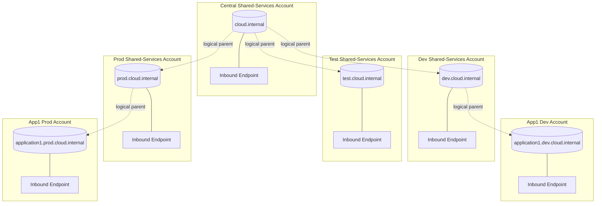
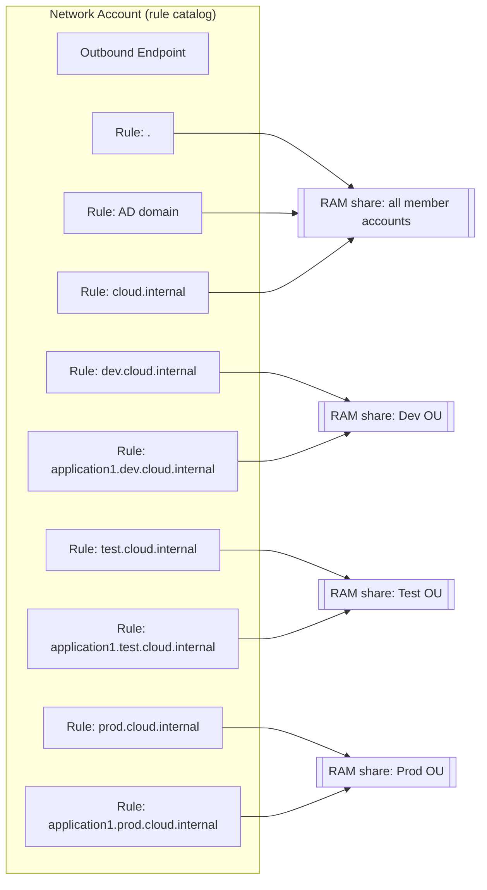
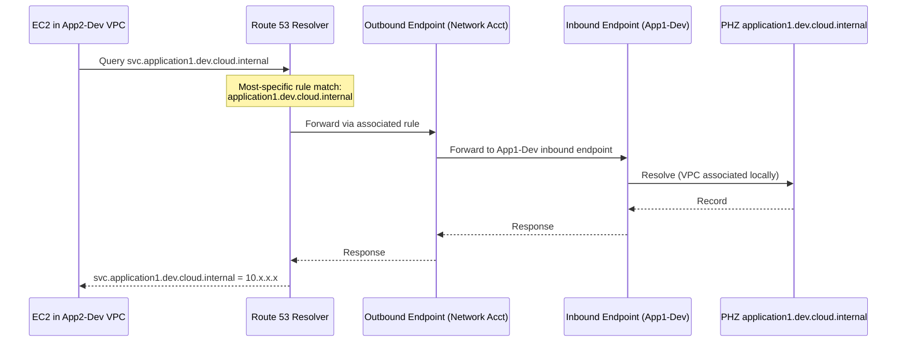

# Part 2 — Private Hosted Zone Hierarchy & Subdomain Delegation

## 1. What We're Modelling

A hierarchical internal namespace under a single apex:

```
cloud.internal                          ← centrally maintained (apex)
├── dev.cloud.internal                  ← lifecycle-tier zone (dev)
│   ├── application1.dev.cloud.internal ← per-app zone in app1 dev account
│   └── application2.dev.cloud.internal ← per-app zone in app2 dev account
├── test.cloud.internal                 ← lifecycle-tier zone (test)
│   └── application1.test.cloud.internal
└── prod.cloud.internal                 ← lifecycle-tier zone (prod)
    └── application1.prod.cloud.internal
```

Each application account owns the leaf zone for its own app/lifecycle combination. The tier zones (`dev|test|prod.cloud.internal`) are owned centrally per lifecycle. The apex is owned by a central shared-services account. Names must be resolvable across the appropriate accounts *within a lifecycle*, but must remain isolated *between* lifecycles because there is no network path between dev/test/prod.

---

## 2. Key Constraint — Route 53 PHZs Do Not Natively Delegate

Public DNS uses NS record delegation to hand off subdomains from a parent zone to a child zone. **Route 53 Private Hosted Zones do not follow NS records for private resolution.** Delegation between PHZs — especially across accounts — is achieved instead through one of:

1. **Cross-account VPC associations** (share a PHZ with another account's VPC via `create-vpc-association-authorization` + `associate-vpc-with-hosted-zone`), or
2. **Route 53 Resolver forwarding rules** targeting an **inbound endpoint** in the account that hosts the child PHZ.

For an organization of this size and shape (many accounts, org-managed, no cross-lifecycle network path, existing RAM-based pattern for the AD rule), **(2) forwarding rules shared via RAM** is the scalable, consistent choice — and matches the pattern already used elsewhere in the environment. Approach (1) is used only in one specific spot: attaching the apex zone to the resolver VPC so its records are actually resolvable when queried via the inbound endpoint.

Route 53 Resolver's rule matching is **most-specific-domain wins**, which is what makes hierarchical routing work: a query for `application1.dev.cloud.internal` matches the app1 rule; `something-else.dev.cloud.internal` falls back to the dev-tier rule; `shared.cloud.internal` falls back to the apex rule; anything else falls back to the `.` catch-all from Part 1.

---

## 3. Where Each Private Hosted Zone Lives

| Zone | Owning account | Purpose |
|---|---|---|
| `cloud.internal` (apex) | **Central shared-services account** (can be the Network account or a dedicated DNS/shared-services account) | Holds cross-lifecycle common records (e.g., `docs.cloud.internal`, `wiki.cloud.internal`) |
| `dev.cloud.internal` | **Dev shared-services account** | Holds records shared across dev applications (e.g., `artifact.dev.cloud.internal`); acts as tier apex |
| `test.cloud.internal` | **Test shared-services account** | Same, for test tier |
| `prod.cloud.internal` | **Prod shared-services account** | Same, for prod tier |
| `application1.dev.cloud.internal` | **Application 1 dev account** | Application-specific records (ALBs, RDS endpoints, etc.) |
| `application1.test.cloud.internal` | **Application 1 test account** | Same, for test |
| `application1.prod.cloud.internal` | **Application 1 prod account** | Same, for prod |
| … | … | … |

The apex and each tier zone are hosted in a **shared-services account for that scope**. If separate lifecycle-shared accounts don't exist, all tier zones can be hosted in the Network account, but per-lifecycle shared accounts are cleaner because it aligns ownership with lifecycle isolation.

---

## 4. Resolver Endpoints and Rules — the Delegation Wiring

### 4.1 Endpoints
Each account that hosts a PHZ needs a Route 53 Resolver **inbound endpoint** in a VPC associated with that PHZ, so cross-account queries can reach it. Concretely:

| Endpoint | Account | Attached VPC associated to |
|---|---|---|
| Central inbound endpoint | Central shared-services account | `cloud.internal` |
| Dev inbound endpoint | Dev shared-services account | `dev.cloud.internal` |
| Test inbound endpoint | Test shared-services account | `test.cloud.internal` |
| Prod inbound endpoint | Prod shared-services account | `prod.cloud.internal` |
| App1-dev inbound endpoint | Application 1 dev account | `application1.dev.cloud.internal` |
| App1-test inbound endpoint | Application 1 test account | `application1.test.cloud.internal` |
| App1-prod inbound endpoint | Application 1 prod account | `application1.prod.cloud.internal` |

The **outbound endpoint** stays where it already is — in the Network account's Endpoint VPC (from Part 1). One outbound endpoint serves all rules created in the Network account. Rules can be created in the Network account regardless of where the target inbound endpoint lives, because a rule just references target IPs.

### 4.2 Forwarding rules (all created in the Network account, shared via RAM)

| Rule domain | Target IPs | Shared with (RAM) |
|---|---|---|
| `cloud.internal` | Central inbound endpoint IPs | All member accounts (dev + test + prod OUs) |
| `dev.cloud.internal` | Dev inbound endpoint IPs | **Dev OU only** |
| `test.cloud.internal` | Test inbound endpoint IPs | **Test OU only** |
| `prod.cloud.internal` | Prod inbound endpoint IPs | **Prod OU only** |
| `application1.dev.cloud.internal` | App1-dev inbound endpoint IPs | **Dev OU only** |
| `application1.test.cloud.internal` | App1-test inbound endpoint IPs | **Test OU only** |
| `application1.prod.cloud.internal` | App1-prod inbound endpoint IPs | **Prod OU only** |

Rule → OU sharing is what enforces the lifecycle isolation at the DNS layer: a dev VPC simply never has any rule for `prod.cloud.internal` or its subdomains associated to it, so those names are unresolvable from dev — matching the existing network isolation.

### 4.3 Local PHZ associations

For the application account itself, its own PHZ (e.g. `application1.dev.cloud.internal`) is **associated directly** to the local VPC. This is important:

- The most-specific-match wins rule means a query from within the application's own VPC for a name in its own zone is resolved **locally via the PHZ association**, never sent through the resolver rule. This is the fast path and it also means the app can resolve its own records even if the shared inbound endpoint has an outage.
- The forwarding rule for the same domain is still created and shared, so that **other** accounts in the same lifecycle can resolve into this zone.

Similarly, each tier shared-services account associates its own tier zone to its local VPC.

---

## 5. Should Cross-Account PHZ Associations Be Used?

Only sparingly:

- **Yes** — associate each PHZ with a VPC in its owning account (so records are resolvable at all when the inbound endpoint receives a query).
- **No** — do not use cross-account PHZ associations (`create-vpc-association-authorization`) as the primary delegation mechanism. It scales poorly (per-VPC pairing, no RAM/OU semantics), it entangles ownership, and it bypasses the Network account, breaking the "central rule catalog" pattern already in use for AD.

Use **forwarding rules** as the delegation mechanism; use **local PHZ associations** only to make the target zone resolvable at its inbound endpoint.

---

## 6. Example — Resolution Flows in the Dev Lifecycle

Assume a workload in **Application 2, Dev account** (`app2-dev`) queries different names. Its VPC has these Resolver rule associations (all shared via RAM to the Dev OU):

- `.` → on-prem DNS (from Part 1)
- AD domain → on-prem DCs (from Part 1)
- `cloud.internal` → central inbound endpoint
- `dev.cloud.internal` → dev-shared inbound endpoint
- `application1.dev.cloud.internal` → app1-dev inbound endpoint
- `application2.dev.cloud.internal` → app2-dev inbound endpoint (harmless — most-specific match still causes the *local PHZ association* to win)

Plus its own PHZ `application2.dev.cloud.internal` associated locally.

| Query | What matches | Where the answer comes from |
|---|---|---|
| `db.application2.dev.cloud.internal` | Local PHZ association (most specific) | Local PHZ in app2-dev — never leaves the VPC |
| `svc.application1.dev.cloud.internal` | Rule for `application1.dev.cloud.internal` | Forwarded to app1-dev inbound endpoint → resolved from app1's PHZ |
| `artifact.dev.cloud.internal` | Rule for `dev.cloud.internal` | Forwarded to dev-shared inbound endpoint → resolved from dev-tier PHZ |
| `docs.cloud.internal` | Rule for `cloud.internal` | Forwarded to central inbound endpoint → resolved from apex PHZ |
| `example.com` | Rule for `.` | Forwarded to on-prem DNS |
| `svc.application1.prod.cloud.internal` | No rule (prod rules not shared to dev) → falls through to `.` catch-all | On-prem DNS returns NXDOMAIN (correct — dev must not resolve prod) |

---

## 7. Diagrams

### 7.1 Ownership map



The "logical parent" dotted lines are **not** DNS NS delegations — they're realized as Resolver forwarding rules in the Network account (see next diagram).

### 7.2 Rule catalog in the Network account and RAM sharing



### 7.3 Resolution flow — cross-app within the dev lifecycle



---

## 8. Rule-Precedence Cheat Sheet

Given a query from a workload, Route 53 Resolver evaluates in this order and picks the first match:

1. Any **PHZ associated to this VPC** whose zone name is a suffix of the query, most-specific first.
2. Any **Resolver rule associated to this VPC** whose domain is a suffix of the query, most-specific first.
3. The Amazon-provided default resolver (public DNS) — which in this environment fails, since no IGW/NAT exists.

Because of (1), an app's own zone always resolves locally. Because of (2) and the RAM-scoped sharing, cross-app resolution within the same lifecycle works but cross-lifecycle resolution does not. Because of the `.` catch-all rule from Part 1, anything not otherwise matched is sent on-prem.

---

## 9. Implementation Checklist

For each new PHZ (apex / tier / application):

1. **PHZ owner account**
   - [ ] Create the Private Hosted Zone.
   - [ ] Associate it with the account's local VPC.
   - [ ] Create a Resolver **inbound endpoint** in that VPC (two IPs across two AZs).
   - [ ] Security Group on inbound endpoint ENIs: allow UDP/TCP 53 from the Network account's outbound endpoint ENI security group (or the outbound endpoint's private IPs).
   - [ ] Note the inbound endpoint's IPs.
2. **Network account**
   - [ ] Create a Resolver forwarding rule for the zone's domain → the inbound endpoint IPs from step 1.
   - [ ] Verify Network-account VPC route table has an explicit TGW route to the PHZ-owner account's VPC CIDR.
3. **AWS RAM**
   - [ ] Share the forwarding rule to the correct OU (all OUs for the apex; single lifecycle OU otherwise).
4. **Member accounts (in scope)**
   - [ ] Auto-accept (if Organizations-based sharing) or explicitly accept.
   - [ ] Associate the shared rule with each local VPC.
5. **TGW**
   - [ ] Confirm explicit TGW routes exist between the Network account VPC (where the outbound endpoint lives) and each PHZ-owner account VPC (where the inbound endpoint lives), in both directions. This is the only network-routing prerequisite for cross-account DNS delegation via forwarding.
6. **Validate**
   - [ ] From a workload in the appropriate lifecycle, resolve: apex record, tier record, own-app record, other-app record. Confirm cross-lifecycle records do **not** resolve.

---

## 10. Notes and Trade-offs

- **Records at each level** should reflect true ownership: apex zone holds only cross-lifecycle common records; tier zones hold tier-shared records; app zones hold app records. Don't put app records in the tier zone — that defeats delegation.
- **Automation**: application account provisioning should, as part of vending, (a) create the app PHZ, (b) create the inbound endpoint, (c) call the Network account (via a pipeline / cross-account role) to create + share the corresponding forwarding rule. CloudFormation StackSets or a custom Service Catalog product both work.
- **TGW east-west traffic**: cross-account DNS forwarding within a lifecycle requires TGW routes between the Network account VPC and each PHZ-owner account VPC. Given "explicit routes with no propagation," these routes must be added per attachment as part of onboarding.
- **Fault isolation**: if the central inbound endpoint is down, only `cloud.internal` apex names fail. If a tier inbound endpoint is down, only that tier's shared names fail. App zones always resolve locally within their own VPC because of the local PHZ association — this design deliberately keeps the app's own-name resolution independent of any shared-services availability.
- **Do not add NS records** in the parent PHZ pointing at the child zone. They will be ignored by Route 53 Resolver and only cause confusion. The forwarding rule is the delegation.
