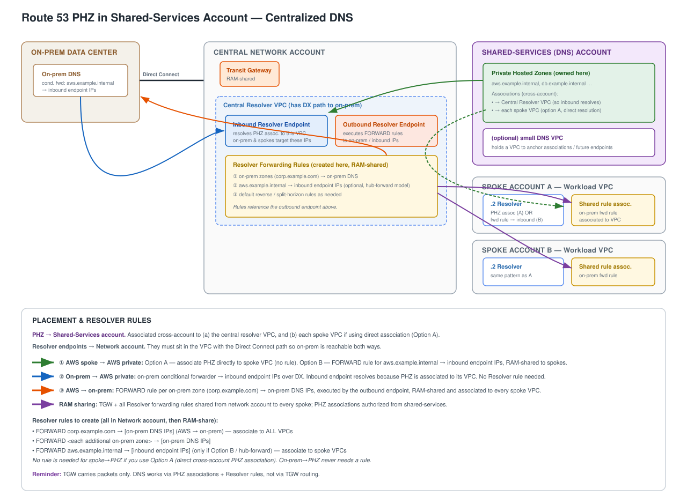

# Route 53 Private Hosted Zones in a Shared-Services Account — Centralized DNS



> The diagram is provided as both `dns-shared-services.png` (embedded above) and `dns-shared-services.svg` (vector source).

## Topology assumptions
- **Central network account** handles centralized ingress/egress control.
- **Direct Connect** between the on-premises data center and the network account.
- **Transit Gateway (TGW)** in the network account, shared to all other accounts via AWS RAM.
- **Dedicated shared-services (DNS) account** now owns the Private Hosted Zones.

## What moved, and why
- **PHZs → shared-services account.** Isolates Route 53 blast radius and IAM from routing/firewall config.
- **Resolver endpoints stay in the network account's central VPC.** They must sit in the VPC that has the Direct Connect path, because that is the only VPC with a route to on-prem for both inbound (on-prem reaching in) and outbound (AWS reaching out).
- The PHZ-to-endpoint link is made by **cross-account associating** the shared-services PHZ to the network resolver VPC.

## Key concept
**TGW routes IP packets — it does not resolve DNS.** Sharing TGW via RAM provides connectivity only. PHZ resolution is driven by **VPC-to-PHZ associations** evaluated at each VPC's `.2` resolver, plus **RAM-shared Resolver forwarding rules**. Account boundaries and TGW are irrelevant to the resolution step.

## PHZ associations (from the shared-services account)
Authorize from the PHZ owner (shared-services), associate from the VPC owner.

- Shared-services PHZ → **central resolver VPC** (network account). Required so the inbound endpoint can resolve the zone for on-prem queries.
- Shared-services PHZ → **each spoke VPC** — only if using **Option A** (direct resolution; see below).

## Resolver rules to set up
All FORWARD rules are created in the **network account** (a forwarding rule must reference the outbound endpoint, which lives there), then **RAM-shared** and associated to the relevant VPCs.

| # | Rule type | Domain | Forward target | Associate to | Purpose |
|---|-----------|--------|----------------|--------------|---------|
| 1 | FORWARD | `corp.example.com` (each on-prem zone) | on-prem DNS server IPs | **all** VPCs (spokes + shared-svc) | AWS → on-prem (flow ③) |
| 2 | FORWARD | `aws.example.internal` | **inbound endpoint IPs** | spoke VPCs | spoke → PHZ — **only if Option B** |

Two paths deliberately need **no** Resolver rule:
- **On-prem → AWS private domains (flow ②).** Handled by the on-prem conditional forwarder pointing at the inbound endpoint IPs over Direct Connect. The inbound endpoint resolves the zone because the PHZ is associated to its VPC.
- **Spoke → PHZ under Option A.** Direct cross-account PHZ association means the spoke `.2` resolves locally with no rule.

## Resolution flows
1. **AWS spoke → AWS private domains.** Option A: associate PHZ directly to spoke VPC (no rule). Option B: FORWARD rule for the private domain → inbound endpoint IPs, RAM-shared to spokes.
2. **On-prem → AWS private domains.** On-prem conditional forwarder → inbound endpoint IPs over Direct Connect. No Resolver rule.
3. **AWS → on-prem domains.** FORWARD rule per on-prem zone → on-prem DNS IPs, executed by the outbound endpoint, RAM-shared and associated to every spoke VPC.

## The one decision: Option A vs Option B for spoke resolution

**Option A — direct PHZ association.**
- Associate the shared-services PHZ to every spoke VPC; no rule #2.
- Resolution is local and fast; no dependency on the network VPC being healthy.
- Cost: an authorize-then-associate pair per spoke per zone — association sprawl grows with accounts × zones.

**Option B — hub forwarding.**
- Associate the PHZ only to the network resolver VPC; spokes get rule #2 forwarding the private domain to the inbound endpoint.
- Far fewer associations, centrally managed.
- Cost: every private-domain lookup traverses the network VPC, which becomes a resolution dependency and a throughput consideration (inbound endpoints are throttled per ENI).

Most enterprises pick **Option A** at moderate zone/account counts (cleaner failure domain) and **Option B** at high account counts. Mixing is valid: associate high-traffic core zones directly, forward the long tail.

> **Caveat:** keep the private namespace **disjoint** from any on-prem zone. If the same zone exists as both a PHZ and an on-prem zone, you are in split-horizon territory and must be deliberate about which rule/association wins in each VPC.

## Cross-account PHZ association (CLI)
```bash
# In the shared-services (PHZ-owning) account
aws route53 create-vpc-association-authorization \
  --hosted-zone-id Z0SHAREDSVC123 \
  --vpc VPCRegion=us-east-1,VPCId=vpc-spoke111

# In the spoke (VPC-owning) account
aws route53 associate-vpc-with-hosted-zone \
  --hosted-zone-id Z0SHAREDSVC123 \
  --vpc VPCRegion=us-east-1,VPCId=vpc-spoke111

# Back in the shared-services account, clean up the one-time auth
aws route53 delete-vpc-association-authorization \
  --hosted-zone-id Z0SHAREDSVC123 \
  --vpc VPCRegion=us-east-1,VPCId=vpc-spoke111
```

> **Reminder:** TGW carries packets only. DNS works via PHZ associations + Resolver rules, not via TGW routing.
