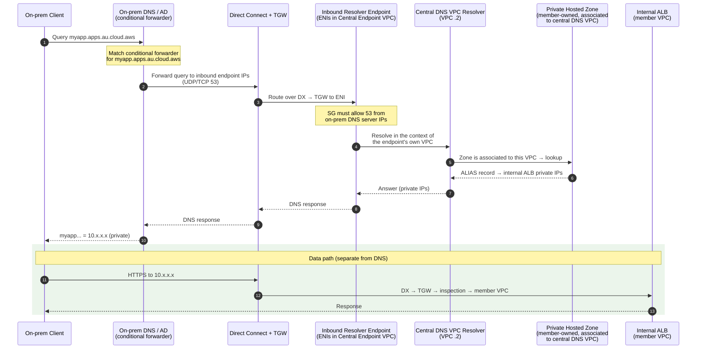
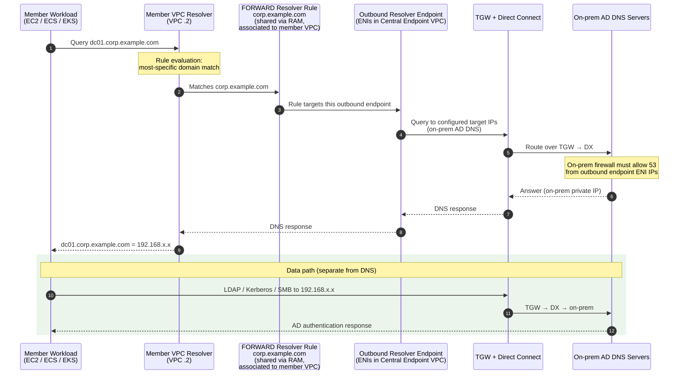
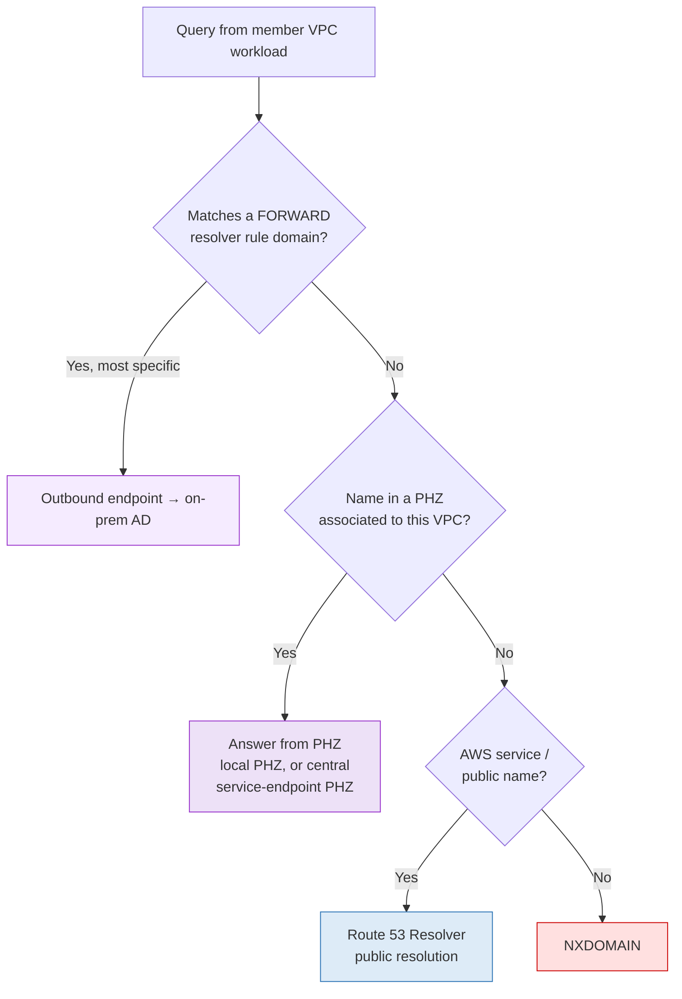

# Hybrid DNS Resolution Flows (Mermaid)

Two directions, two different mechanisms:

| Direction | Mechanism | Key object |
|---|---|---|
| On-prem → AWS | Conditional forwarder on on-prem DNS → **inbound** endpoint IPs | PHZ **associated to the inbound endpoint's VPC** |
| AWS → on-prem | **FORWARD resolver rule** associated to the VPC → **outbound** endpoint | Rule shared via **RAM** |

---

## 1) On-Premises Client → AWS (inbound)

Example: `myapp.apps.au.cloud.aws` (vanity URL → internal ALB in a member account).

**Critical dependency:** the inbound endpoint has no resolution logic of its own — it answers using **its own VPC's resolver**. If the member PHZ is *not* associated to the central DNS VPC, this flow returns NXDOMAIN/SERVFAIL.

---

## 2) AWS Client → On-Premises DNS (outbound)

Example: a Windows member server resolving `corp.example.com` (Active Directory).

**Critical dependency:** the **rule** must be associated to the *member* VPC (after the RAM share is accepted). Sharing alone does nothing — association is what activates it. The outbound endpoint stays in the central account and is never shared.

---

## 3) Resolution precedence in a member VPC

Useful for reasoning about which mechanism wins:

> Note: with **no NAT/IGW**, branch **F** cannot reach the internet. This is exactly why service-endpoint PHZs must be associated to member VPCs — so AWS service names resolve to **interface endpoint private IPs** at branch **D** rather than falling through to public resolution.

---

## Common failure points

| Symptom | Likely cause |
|---|---|
| On-prem gets NXDOMAIN for AWS private name | PHZ not associated to the **inbound endpoint's VPC** |
| On-prem query times out | SG on inbound endpoint blocks 53; or no TGW/DX route back to on-prem |
| AWS workload can't resolve AD domain | Rule shared via RAM but **not associated** to the member VPC |
| AWS resolves AD name, can't connect | DNS fine — check TGW routes / firewall on the data path |
| AWS service name resolves to public IP | Service-endpoint PHZ not associated to member VPC (or endpoint private DNS misconfigured) |
| Wrong zone answers in shared DNS VPC | Overlapping PHZ namespaces — enforce unique per-project domains |