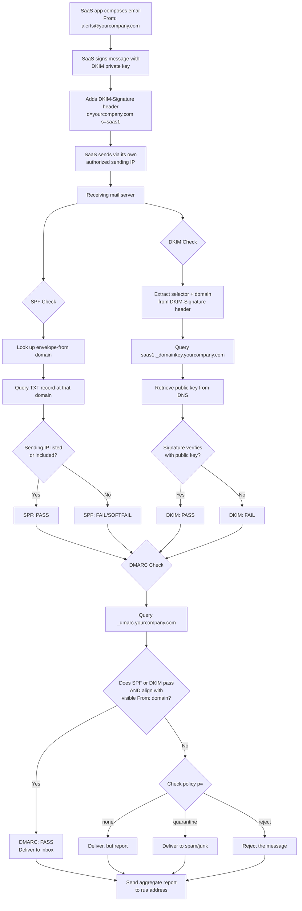

# SPF, DKIM, and DMARC for SaaS Applications Sending on Behalf of a Corporate Domain

## The Three-Way Relationship

When a SaaS app (e.g., a marketing platform) sends email "from" a domain like `yourcompany.com`, three independent things have to line up.

### SPF (Sender Policy Framework)

- The **corporate domain owner** (yourcompany.com's DNS admin) publishes a TXT record listing which mail servers/IPs are authorized to send as that domain.
- To authorize the SaaS app, they add an `include:` mechanism pointing to the SaaS provider's SPF record (e.g., `include:spf.saasapp.com`), since the SaaS provider maintains its own sending IP list and updates it independently.
- SPF checks the **envelope-from** (Return-Path), not the visible "From" header.

### DKIM (DomainKeys Identified Mail)

- **The SaaS application generates the public/private keypair** — not the domain owner. This is because the SaaS app needs the private key locally to sign outgoing mail.
- The SaaS app gives the domain owner: a **selector** (a short name like `saas1`) and the **public key**.
- The domain owner publishes the public key as a DNS TXT record at `selector._domainkey.yourcompany.com`.
- The private key never leaves the SaaS provider's infrastructure.
- The SaaS app signs each outgoing message with the private key, adding a `DKIM-Signature` header containing the selector, domain, signed headers, and the signature hash.

### DMARC (Domain-based Message Authentication, Reporting & Conformance)

- Also published by the **domain owner**, at `_dmarc.yourcompany.com`, as a TXT record.
- Declares policy (`p=none/quarantine/reject`), alignment requirements, and where to send aggregate/failure reports (`rua`/`ruf`).
- DMARC doesn't do its own crypto check — it just requires that SPF or DKIM **pass AND align** with the visible From: header domain.

---

## Diagram 1: Setup Phase (Who Creates/Publishes What)

```mermaid
sequenceDiagram
    participant Corp as Corporate Domain Owner<br/>(yourcompany.com DNS admin)
    participant SaaS as SaaS Application
    participant DNS as Public DNS<br/>(yourcompany.com zone)

    Note over SaaS: SaaS generates DKIM keypair<br/>(private key stays on SaaS servers)
    SaaS->>Corp: Provides DKIM public key + selector<br/>e.g. selector=saas1
    SaaS->>Corp: Provides list of sending IPs / SPF include string

    Corp->>DNS: Publish SPF TXT record<br/>"v=spf1 include:spf.saasapp.com ~all"
    Corp->>DNS: Publish DKIM TXT record<br/>saas1._domainkey.yourcompany.com<br/>"v=DKIM1; p=<public key>"
    Corp->>DNS: Publish DMARC TXT record<br/>_dmarc.yourcompany.com<br/>"v=DMARC1; p=quarantine; rua=mailto:..."

    Note over SaaS,DNS: Setup complete — SaaS can now send<br/>authenticated mail as yourcompany.com
```

---

## Diagram 2: Send-Time Signing and Receive-Time Verification



---

## A Few Things Worth Knowing

- **Alignment** is the subtlety people miss: DKIM can technically pass while signing a *different* domain than the visible From: header — DMARC requires the signed `d=` domain to match (or be a subdomain of) the From: header domain for "strict" alignment, or share the organizational domain for "relaxed."
- **Key rotation**: since the SaaS provider holds the private key, they're also responsible for rotating it — they generate a new keypair, ask the domain owner to publish a new selector's public key, then cut over signing to the new key before retiring the old DNS record.
- **Multiple SaaS senders**: this is why you often see multiple selectors (`google._domainkey`, `mailchimp._domainkey`, `s1._domainkey`, etc.) — each SaaS platform manages its own keypair and selector independently under the same parent domain.
